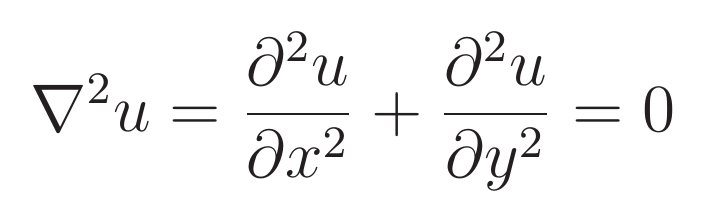
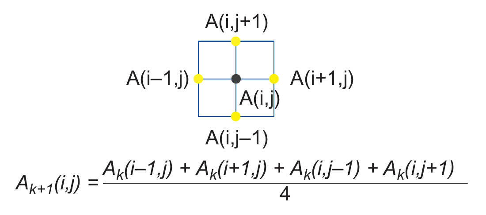

## Examplo 1 - A Laplace Solver Using Simple Jacobi Iteration

This program solves Laplace's equation on a regular grid using simple Jacobi iteration. Laplace's equation in two dimensions is:

Lets assume the grid A. We can discretize Laplace equation as shown in the figure below.

### How to compile

´´´ pgcc -fast -ta=tesla -Minfo=all <exemplo>.c ´´´

